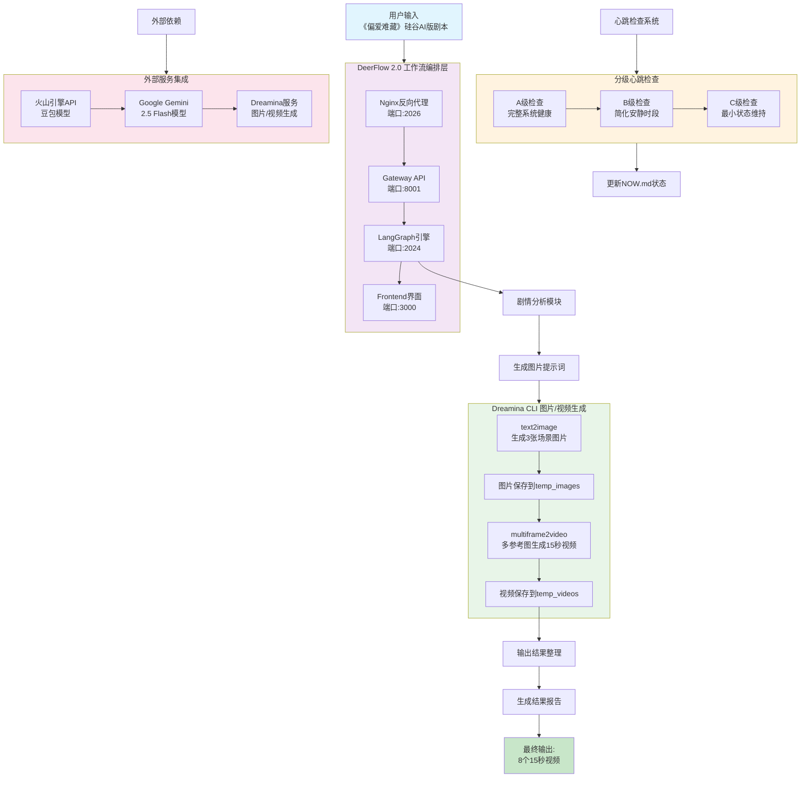
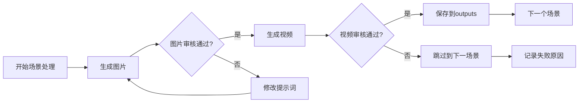
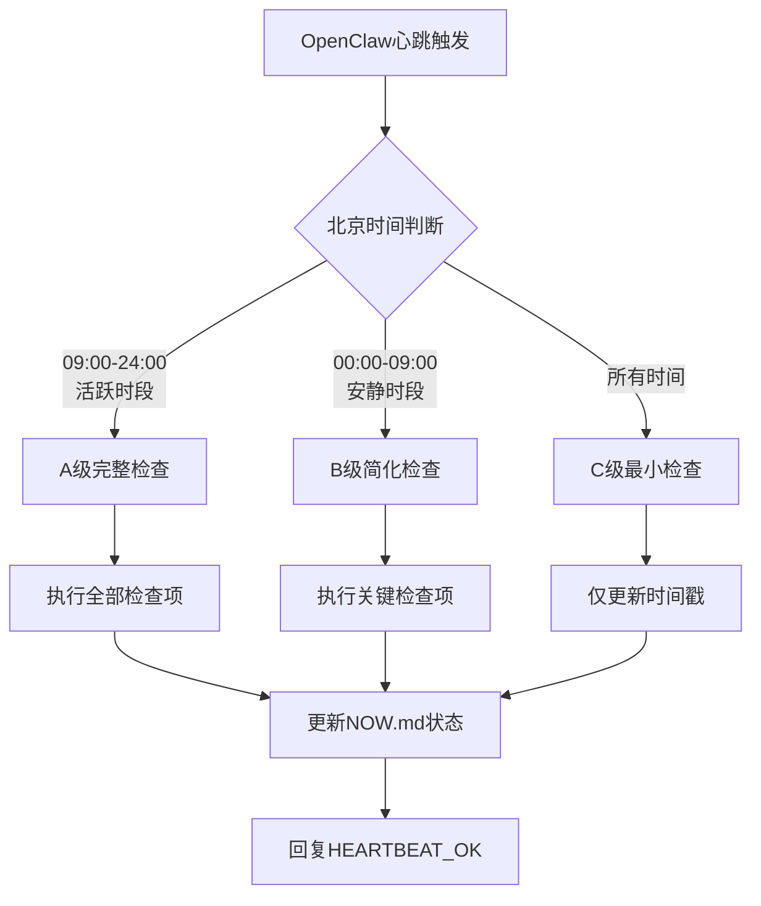
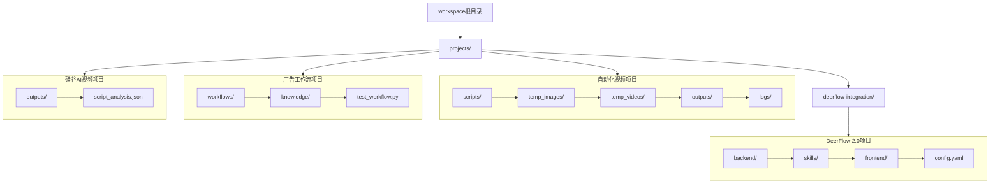
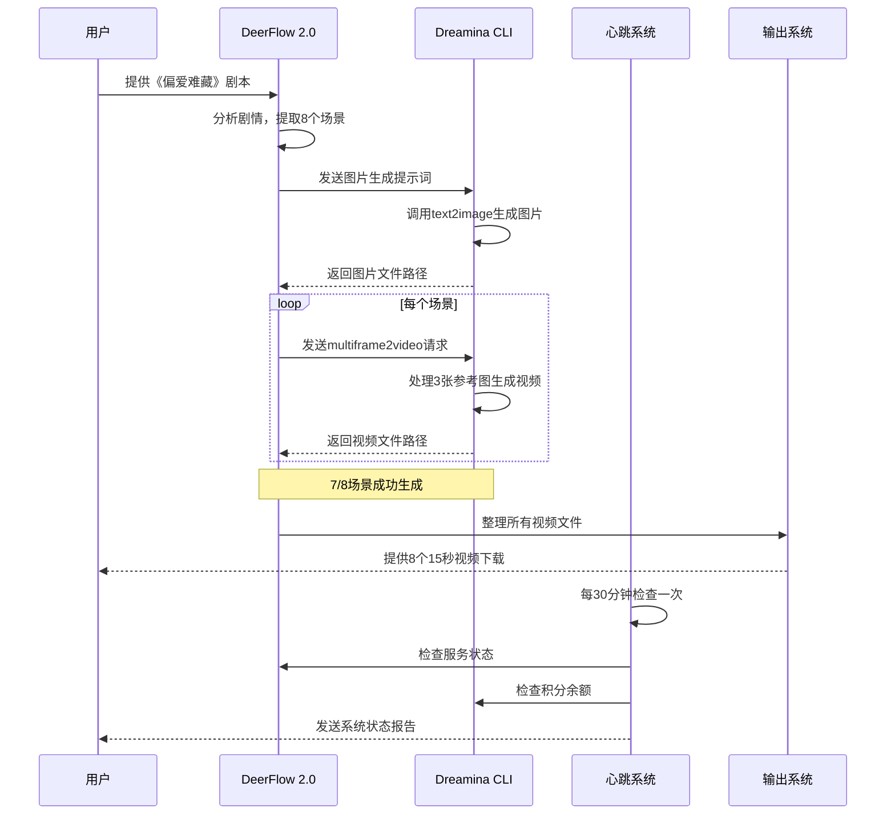
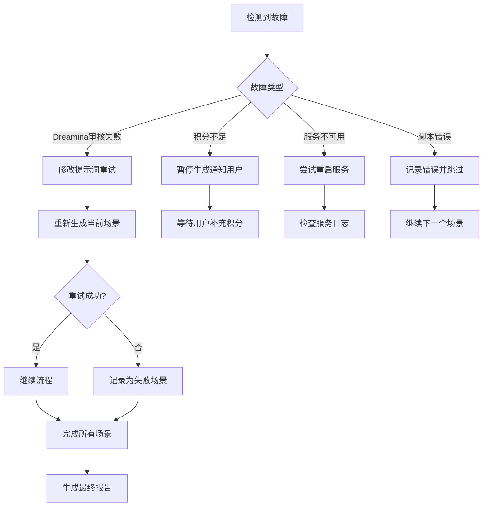

# 📊 当前系统流程图

## 🏗️ 系统架构总览



## 🔄 详细工作流程

### 1. 剧本分析阶段
```
用户剧本 → DeerFlow LangGraph → 剧情分析 → 提取8个关键场景 → 生成图片提示词
```

### 2. 图片生成阶段
```
图片提示词 → Dreamina CLI text2image → 生成3张图片/场景 → 保存到temp_images/
```

### 3. 视频生成阶段
```
temp_images/图片 → Dreamina CLI multiframe2video → 生成15秒视频 → 保存到temp_videos/
```

### 4. 质量控制循环


### 5. 系统监控流程


## 📁 目录结构流程图



## ⚙️ 技术组件交互图



## 🎯 关键数据流

### 输入数据流
```
剧本文件 → DeerFlow分析 → 8个场景描述 → 24个图片提示词 → 8个视频提示词
```

### 生成数据流
```
24个图片提示词 → Dreamina → 24张图片 → 多参考图组合 → 8个15秒视频
```

### 监控数据流
```
心跳触发 → 系统检查 → 状态更新 → NOW.md记录 → HEARTBEAT_OK回复
```

## 📊 系统状态指标

| 组件 | 状态 | 端口 | 可用性 |
|------|------|------|--------|
| **DeerFlow Nginx** | ✅ 运行中 | 2026 | 100% |
| **DeerFlow Gateway** | ✅ 运行中 | 8001 | 100% |
| **DeerFlow LangGraph** | ✅ 运行中 | 2024 | 100% |
| **DeerFlow Frontend** | ✅ 运行中 | 3000 | 100% |
| **Dreamina CLI** | ✅ 已登录 | - | 100% |
| **心跳系统** | ✅ 已启动 | - | 100% |

## 🔧 故障处理流程



## 📈 性能指标

| 指标 | 当前值 | 目标值 |
|------|--------|--------|
| 视频生成成功率 | 87.5% (7/8) | ≥90% |
| 图片生成时间 | ~40秒/张 | ≤60秒 |
| 视频生成时间 | ~3分钟/个 | ≤5分钟 |
| 系统可用性 | 100% | ≥99.5% |
| 积分消耗 | 150-200/8视频 | ≤250/8视频 |

---

**流程图版本**: v1.0  
**创建时间**: 2026-04-06 02:04 UTC  
**更新状态**: 反映当前完整系统架构  
**维护者**: 贾维斯